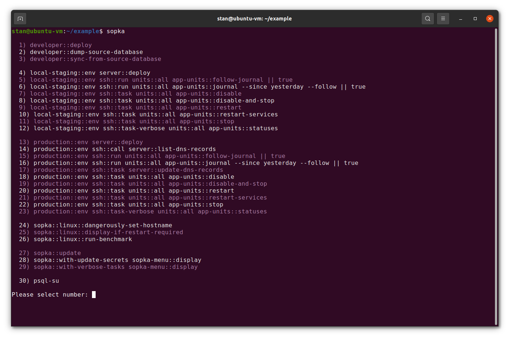

## Sopkafile to deploy Rails/Node.js projects to Linux servers

* Deploy local developer workstation to work with Rails and Node.js projects
* Deploy new production server with the copy of the database from the developer machine
* Copy the database from production to developer machine
